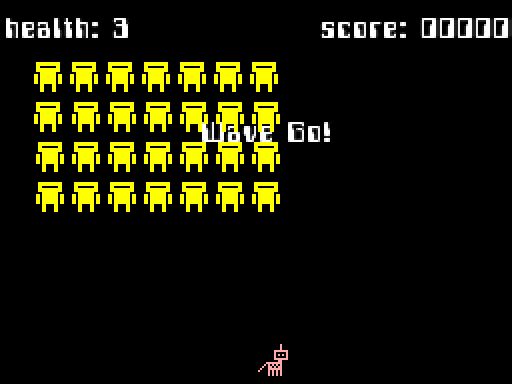
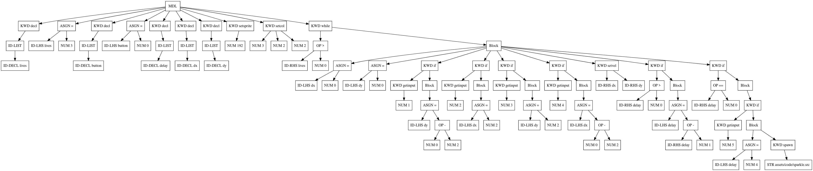
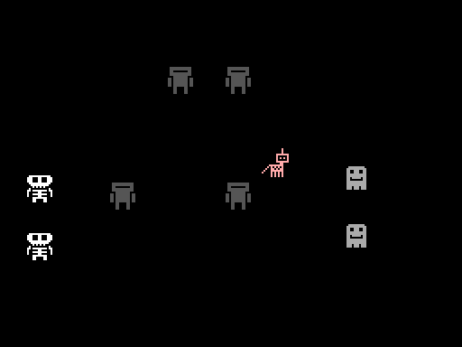

# Morris Programming Language

_Morris_ is a simple programming language for making games. Wherever possible if we could do without it then it has been left out. 

Once we specialise in games, its arguable how extensive a feature set we really need. Also, search based automatic and generative programming is significantly helped by having a more limited set of types.

Currently there are is only two types, __integers__ and __threads__. In addition, there are no functions, no procedures, no classes etc. Instead we have threads which each run in their own little virtual machine. All data inside a thread is private. Communication between the threads is done via a kind of message passing. All messages are broadcast to all threads and disappear immediately, they carry no data except themselves so in a sense they are like semaphores. 

While all this may sound restrictive it turns out to be focussing, because games are highly parallel systems with lots of interacting agents and as developers we want to quash bugs due to shared or stale data and avoid race conditions and other snafoos.

Currently _Morris_ is a language with everything you need in one binary. Compiler and runtime integrated together. Forget dependencies. Distribute sources or compiled bytecode, both are executable. Sometimes you just want to program a game and not worry about the associated technology. No CMake, windowing or opengl configuration no linking woes.

Every thread may have a sprite or some text and also a position and velocity.

Like with the above SFML integration, Morris is a system "with bells on" that is, we intend to include several widely used as closely coupled features from other common libraries e.g. zip archive and local only filesystem, integrated spreadsheet data import for table input.

Morris is a work in progress, its still very early stages. Its likely some things will break and change (for the better).

Morris is influenced by some of the ideas behind [erlang](https://en.wikipedia.org/wiki/Erlang_(programming_language)) and Pascal but Morris programs look very familiar to anyone who has used c js c++ rust or swift. Right now, Morris programs look like this...

~~~

decl lives
lives = 3

decl button
button = 0
decl delay

decl dx
decl dy

setsprite(192)
setcol(3, 2, 2)

while ( lives > 0 ) {

    dx=0 dy=0

    if ( getinput(1) ) { dy=0-2 }
    if ( getinput(2) ) { dx=2 }
    if ( getinput(3) ) { dy=2 }
    if ( getinput(4) ) { dx=0-2 }

    setvel(dx, dy)

    if ( delay > 0 ) {
        delay = delay - 1
    }

    if ( delay == 0 ) {
        if ( getinput(5) ) {
            delay = 4
            spawn("assets/code/sparkle.src")
        }
    }
}

~~~

Which is compiled via an tree like this

## Major ToDos / Goals

- [x] Easy for beginners to learn
- [x] No semicolons
- [x] Familiar Syntax C like block structured syntax
- [x] Integrated with SFML or similar giving Windows, Sprites, Colors, Coords, IO and Networking Library

### With Bells On (currently via SFML)
- [X] Window or Fullscreen (SFML)
- [X] Sprites, Colors, Coords etc (SFML)
- [X] Keyboard IO (SFML)
- [X] Text and Fonts (SFML)

### Safe(er/ish)
- [x] Stack Based Locals, Heap Based Globals
- [x] No pointers because no dynamic heap allocation
- [x] No shared memory between Threads ([erlang](https://en.wikipedia.org/wiki/Erlang_(programming_language)))
- [x] When a Thread exits all the memory associated is released ([erlang](https://en.wikipedia.org/wiki/Erlang_(programming_language)))

### Parallel First
- [x] Parallel execution is trivial and straightforward (via VMs)
- [x] Threads are lightweight userspace objects 
- [x] No Shared Memory, Eliminates Race Conditions and Other Problems
- [ ] Broadcast and Narrow cast Messages between Threads ([erlang](https://en.wikipedia.org/wiki/Erlang_(programming_language)))

## Future
- [ ] Safe File system access constrained to reading and writing local sub dirs only, this is good for indie game distro
- [ ] Filesystem Limited to Zip Internals   (via PhysicsFS or Similar)
- [ ] Integrated Physics and Collision Libs
- [ ] Networking Library (SFML)
- [ ] Sound (SFML)
- [ ] Makes use of underlying parallel hardware where possible. Control of Cores and CPUs
- [ ] Text Tables Database for Languages (CSV?)
- [ ] Syntactic Sugar To Make State and FSMs Easier
- [ ] FSMs and States are first class objects
- [ ] Associative Arrays => Pairs, Tuples & Arrays 
- [ ] access child thread (via return handle? or other method) parent access?
- [ ] expose window controls to language
- [ ] separate window and scheduler loop
- [ ] set movement sprite_size
- [ ] function parsing and code generation
- [ ] procedure parsing and code generation

## Why?

Games dont seem to be object orientated games are more thread orientated. Lets make a system with parallelism at the heart of it and see how that works out.

Sometimes you just want to program a game and not worry about the associated technology. No CMake, windowing or opengl configuration and linking woes.

There was a time when if you wanted to make a game Borland Turbo Pascal was a good way to do it. The language was high level enough that you could focus on the goals. The graphics and so on were integrated with a BGI and/or the VGA was well understood enough to be a stable target. 

Image By Lưu Nguyễn Thiện Hậu - Own work, CC BY-SA 4.0, https://commons.wikimedia.org/w/index.php?curid=75160140

Later Blitz basic and similar compiled game Basics were fast and funky especially for writing games on Amigas. Which all the cool kids had.

By Source, Fair use, https://en.wikipedia.org/w/index.php?curid=45485838

Image By Source (<a href="//en.wikipedia.org/wiki/Wikipedia:Non-free_content_criteria#4" title="Wikipedia:Non-free content criteria">WP:NFCC#4</a>), <a href="//en.wikipedia.org/wiki/File:BlitzBasicLogo.gif" title="Fair use of copyrighted material in the context of BlitzBasic">Fair use</a>, <a href="https://en.wikipedia.org/w/index.php?curid=39065694">Link</a>

Importantly with these kinds of systems the bells and whistles were included. Borland had an integrated editor, and libraries. Similarly Blitz BASIC.

Morris isnt trying to be a general purpose programming language, its trying to be a programming language to write gameplay in.

## Installation Instructions

### Linux

 - First Install SFML

~~~
sudo apt-get install libsfml-dev
~~~

 - Clone the Repo

~~~
git clone https://github.com/seanbutler/Morris.git
~~~

 - Launch CLion
 - Press Shift-F9

### Win/Mac

- err, wanna help? 
- i guess its pretty similar on mac being BSD, but windows i dunno really. please help.

---

## About The Name

### William Morris

"William Morris (24 March 1834 – 3 October 1896) was a British textile designer, poet, novelist, translator and socialist activist associated with the British Arts and Crafts Movement."

https://en.wikipedia.org/wiki/Arts_and_Crafts_movement
https://en.wikipedia.org/wiki/William_Morris

### Morris Dancing

"Morris dancing is a form of English folk dance usually accompanied by music. It is based on rhythmic stepping and the execution of choreographed figures by a group of dancers, usually wearing bell pads on their shins."

https://en.wikipedia.org/wiki/Morris_dance
