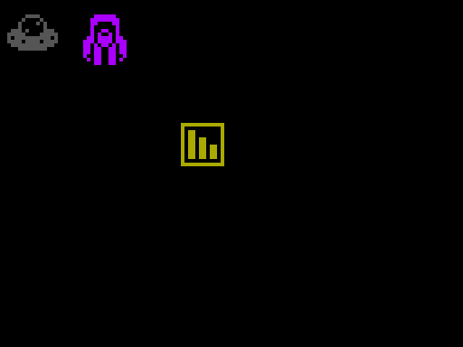

# Morris Programming Language

Everything you need in one binary. Compiler and runtime integrated together. Forget dependencies. Distribute sources or packed compiled bytecode, both executable.

Morris is a programming language hand crafted for making games quickly and easily. Morris has a focus on ease of gameplay programming.

This distribution of Morris is closely integrated with SFML so the common parts of games: graphics, physics, window, input, sound, fonts, networking, etc. are all integrated, cross platform and ready to go because of that wonderful library.

Like with the above SFML integration, Morris is a system "with bells on" that is, we intend to include several widely used as closely coupled features from other common libraries e.g. zip archive and local only filesystem, integrated spreadsheet data import for table input.

Morris is influenced by [erlang](https://en.wikipedia.org/wiki/Erlang_(programming_language))
but Morris programs look very familiar to anyone who has used c js c++ rust or swift. Right now, Morris programs look like this...

~~~

setsprite(29, 8)
setcol(0, 2, 0)

while ( loop <= 999 ) {

    button = getinput(1)
    if ( button ) {
        y = y - 1
    }

    button = getinput(2)
    if ( button ) {
        x = x + 1
    }

    button = getinput(3)
    if ( button ) {
        y = y + 1
    }

    button = getinput(4)
    if ( button ) {
        x = x - 1
    }

    setpos( x, y )
}

~~~

## Design Goals

### Easy
- [x] Easy for beginners to learn
- [x] Familiar Syntax C like block structured syntax
- [x] No semicolons
- [x] Integrated with SFML or similar giving Windows, Sprites, Colors, Coords, IO and Networking Library

### Parallel
- [x] Parallel execution is trivial and straightforward (via VM)
- [x] Threads are lightweight userspace objects 
- [ ] ? Threads are also first class objects
- [ ] ? Maybe Direct/Independent Control of Cores and CPUs

### Safe
- [x] Stack Based Locals, Heap Based Globals
- [x] No pointers because no dynamic heap allocation
- [x] No shared memory between Threads ([erlang](https://en.wikipedia.org/wiki/Erlang_(programming_language)))
- [x] When a Thread exits all the memory associated is released ([erlang](https://en.wikipedia.org/wiki/Erlang_(programming_language)))
- [ ] Broadcast and Narrow cast Messages between Threads ([erlang](https://en.wikipedia.org/wiki/Erlang_(programming_language)))
- [ ] Pure Functions, No Side Effects (https://en.wikipedia.org/wiki/Pure_function)
- [ ] Safe File system access constrained to reading and writing local sub dirs only, this is good for indie game distro

### With Bells On (currently via SFML)
- [X] Window or Fullscreen (SFML) 
- [X] Sprites, Colors, Coords etc (SFML) 
- [X] Keyboard IO (SFML)
- [ ] Integrated Physics and Collision Libs 
- [ ] Networking Library (SFML)
- [ ] Sound (SFML)
- [ ] Filesystem Limited to Zip Internals   (PhysicsFS)
- [ ] Text Tables Database for Languages (CSV?)

Note: this may change to another lib in future depending 

### Finite State Machines
- [ ] Syntactic Sugar Makes State and FSMs Easier
- [ ] Machines and States are first class objects

## Why?

Sometimes you just want to program a game and not worry about the associated technology. No CMake, windowing or opengl configuration and linking woes.

There was a time when if you wanted to make a game Borland Turbo Pascal was a good way to do it. The language was high level enough that you could focus on the goals. The graphics and so on were integrated with a BGI and/or the VGA was well understood enough to be a stable target. 

Image By Lưu Nguyễn Thiện Hậu - Own work, CC BY-SA 4.0, https://commons.wikimedia.org/w/index.php?curid=75160140

Later Blitz basic and similar compiled game Basics were fast and funky especially for writing games on Amigas. Which all the cool kids had.

By Source, Fair use, https://en.wikipedia.org/w/index.php?curid=45485838

Image By Source (<a href="//en.wikipedia.org/wiki/Wikipedia:Non-free_content_criteria#4" title="Wikipedia:Non-free content criteria">WP:NFCC#4</a>), <a href="//en.wikipedia.org/wiki/File:BlitzBasicLogo.gif" title="Fair use of copyrighted material in the context of BlitzBasic">Fair use</a>, <a href="https://en.wikipedia.org/w/index.php?curid=39065694">Link</a>

Importantly with these kinds of systems the bells and whistles were included. Borland had an integrated editor, and libraries. Similarly Blitz BASIC.

Morris isnt trying to be a general purpose programming language, its trying to be a programming language to write gameplay in.

## Installation Instructions

### Linux

 - First Install SFML

~~~
sudo apt-get install libsfml-dev
~~~

 - Clone the Repo

~~~
git clone https://github.com/seanbutler/Morris.git
~~~

 - Launch CLion
 - Press Shift-F9

### Win/Mac

- err, wanna help? 
- i guess its pretty similar on mac being BSD, but windows i dunno really. please help.

---

## About The Name

### William Morris

"William Morris (24 March 1834 – 3 October 1896) was a British textile designer, poet, novelist, translator and socialist activist associated with the British Arts and Crafts Movement."

https://en.wikipedia.org/wiki/Arts_and_Crafts_movement
https://en.wikipedia.org/wiki/William_Morris

### Morris Dancing

"Morris dancing is a form of English folk dance usually accompanied by music. It is based on rhythmic stepping and the execution of choreographed figures by a group of dancers, usually wearing bell pads on their shins."

https://en.wikipedia.org/wiki/Morris_dance
